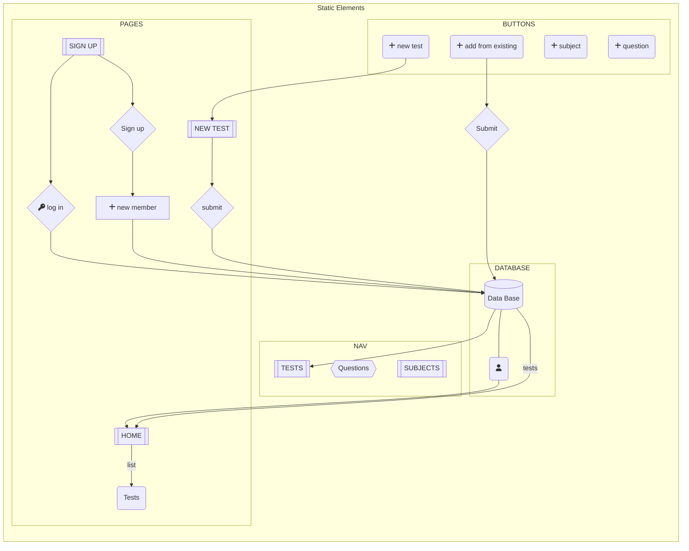

# TestMaker

Angular CLI

  
 

This project was generated with [Angular CLI](https://github.com/angular/angular-cli) version 14.0.4.  
  
## Development server

Run `ng serve` for a dev server. Navigate to `http://localhost:4200/`. The application will automatically reload if you change any of the source files.

## Code scaffolding

Run `ng generate component component-name` to generate a new component. You can also use `ng generate directive|pipe|service|class|guard|interface|enum|module`.

## Build

Run `ng build` to build the project. The build artifacts will be stored in the `dist/` directory.

## Running unit tests

Run `ng test` to execute the unit tests via [Karma](https://karma-runner.github.io).

## Running end-to-end tests

Run `ng e2e` to execute the end-to-end tests via a platform of your choice. To use this command, you need to first add a package that implements end-to-end testing capabilities.

## Further help

To get more help on the Angular CLI use `ng help` or go check out the [Angular CLI Overview and Command Reference](https://angular.io/cli) page.
  

Project context

## Minimum requested requirements:

* Front end:

  * The use of a framework is not mandatory but it is recommended (In the case of not using a framework, a packager should be used Eg: Parcel)
  * The frontend will make requests to the REST API
  * From the front part you have to be able to perform the actions of a CRUD

* back end:

  * The backend part must be done with JAVA and using Springboot
  * A REST API must be built so that the front can consume the data.
  * The API must allow performing a CRUD

* Extra:

  * Implement the possibility of performing a search for a specific piece of data with a search engine
  
  
## Pedagogical Modalities
  
* The organization at the sprint level is free. The development team must follow the SCRUM framework in terms of organization. Management tools such as Jira, Trello or GitKraken or other must be used. It will be evaluated according to the established competency framework, the self-assessment will be done individually (competency tree).

## Performance criteria
  
  
### The final result must meet the minimum requirements.

* Evaluation Modalities
  
  * Product demos. Oral presentation as well as slide presentation of the workflow. Code review.

* Deliverables
  - Link to the presentation of the project
  - Repository Link
  
  
  

  

User Flow

    
    

  
  
  

